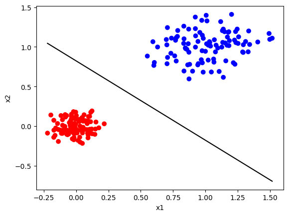
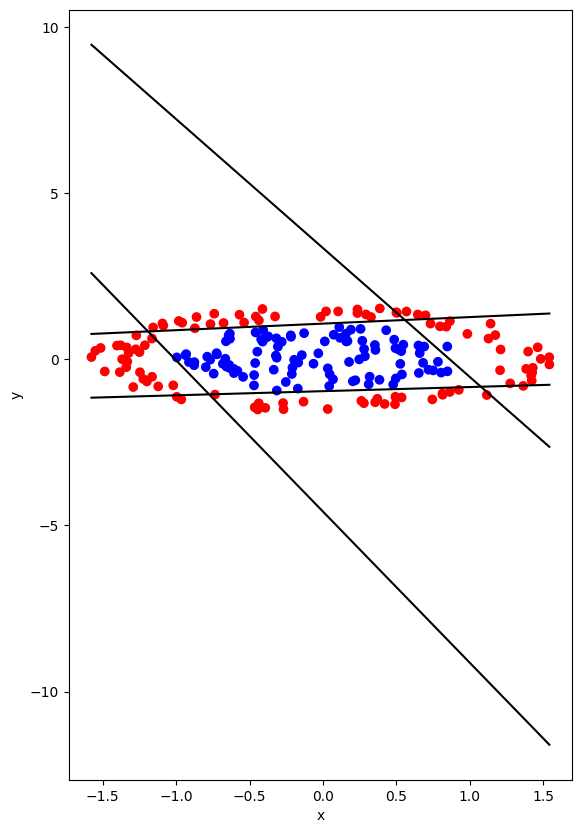

# Training a neural network with Adaline and Madaline
## Description

This repository contains implementations of Adaline and Madaline, which are types of linear regression models. These models are trained using the gradient descent algorithm to find the optimal weights and bias for a given dataset. The models aim to separate data points into two classes by learning linear decision boundaries.
Adaline

## Adaline
 (Adaptive Linear Neuron) is a single-layer neural network with a linear activation function. It is trained using the gradient descent algorithm to minimize the sum of squared errors (SSE) between the predicted outputs and the true outputs. The algorithm adjusts the weights and bias of the model iteratively to find the optimal values that minimize the SSE.
Madaline

## Madaline
 (Multiple Adaptive Linear Neurons) is an extension of Adaline that allows for multiple linear decision boundaries. It consists of multiple Adaline units that collectively classify the data. Each Adaline unit corresponds to a linear decision boundary, and the outputs of these units are combined using a majority voting scheme to determine the final classification.

## Files
I tried to use ready-made functions as little as possible. I didn't even use the dot function and I wrote the internal matrix multiplication function myself.

This repository contains the following files:

<b>adaline.ipynb</b>: This file contains the implementation of the Adaline model. It includes functions for initializing the weights and bias, performing forward propagation, calculating the error, updating the weights and bias using gradient descent, and predicting the class labels.

(plot_line function (Show the dividing line between two classes) just work on 2d)

<b>madaline.ipynb</b>: This file contains the implementation of the Madaline model. It includes functions for initializing the Adaline units, training the units using gradient descent, combining the outputs of the units, predicting the class labels, and evaluating the accuracy of the model.

(plot_line function (Show the dividing lines between two classes) just work on 2d)